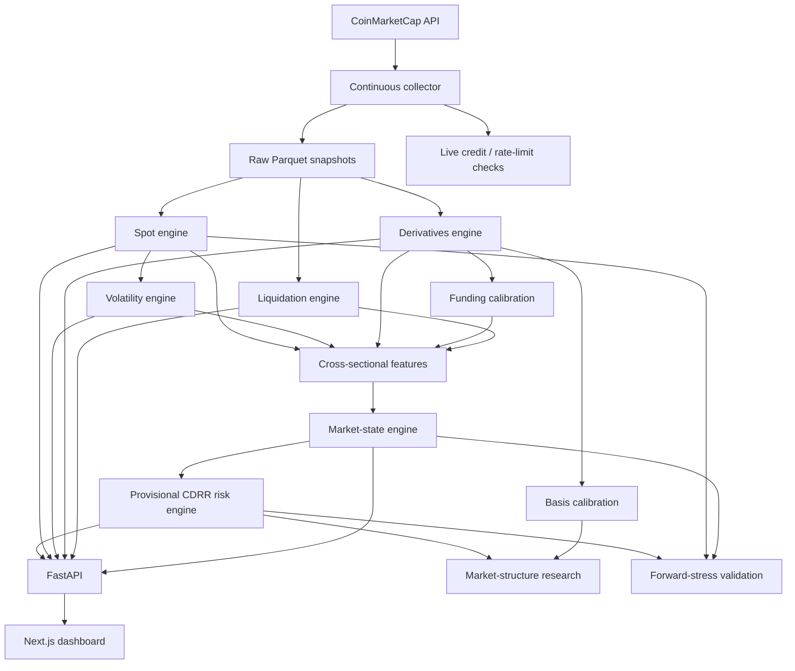

# Architecture

## Overview

Crypto Derivatives Risk Radar is organised as a small event-driven analytics pipeline built around continuously refreshed Parquet snapshots.

The architecture deliberately separates five concerns:

1. **data acquisition**;
2. **data cleaning and feature engineering**;
3. **state/risk modelling**;
4. **serving and visualisation**;
5. **research and validation**.

This separation keeps experimental modelling work from silently changing the production dashboard.

---

## Data flow



---

## 1. Collector

`scripts/collect_data.py` is the orchestration layer.

The collector:

- obtains live CoinMarketCap usage information;
- estimates a safe polling interval from monthly credits and rate limits;
- enforces a minimum interval above the upstream derivatives cache frequency;
- maintains a lock file so multiple collectors cannot run accidentally;
- collects the raw market data;
- executes the processed feature engines in dependency order;
- runs research-only market-structure analysis after successful basis and risk updates.

The current processed order is:

```text
Spot
  -> Volatility
  -> Derivatives
  -> Funding
  -> Basis
  -> Liquidations
  -> Market States
  -> CDRR Risk
  -> Market-Structure Research
```

The forward-validation script is intentionally run on demand because future targets mature at different horizons.

---

## 2. Storage

Parquet is used as the primary local storage format.

Conceptually:

```text
data/
├── raw/
│   ├── spot/
│   └── derivatives/
├── processed/
│   ├── spot/
│   ├── volatility/
│   ├── derivatives/
│   ├── funding/
│   ├── basis/
│   ├── liquidations/
│   ├── states/
│   └── risk/
└── research/
    ├── market_structure/
    └── forward_validation/
```

Raw, processed and research datasets are excluded from Git. The repository contains the code required to reconstruct them from authorised CoinMarketCap access.

---

## 3. Feature engines

### Spot

`backend/risk_radar/spot.py`

Produces local price context and lagged 1h/4h/24h spot features.

### Volatility

`backend/risk_radar/volatility.py`

Produces realised volatility, volatility expansion, conditional variance forecasts and model diagnostics.

### Derivatives

`backend/risk_radar/derivatives.py`

Validates derivative contracts, deduplicates venues, aggregates open interest and constructs concentration statistics.

A key design feature is the **common-universe OI change**, which compares only contracts observed and valid at both the current and lagged snapshot.

### Funding

`backend/risk_radar/funding.py`

Separates funding sign from funding extremeness and combines cross-sectional and historical calibration when sufficient history exists.

### Basis

`backend/risk_radar/basis.py`

Separates:

- central basis magnitude;
- cross-venue basis dispersion.

These remain research inputs until calibration is mature enough to justify production use.

### Liquidations

`backend/risk_radar/liquidations.py`

Calibrates liquidation activity against a strict prior-only 24h baseline, normalises liquidation activity by OI, and keeps liquidation direction separate from stress magnitude.

Exchange-concentration HHI is calculated from internally normalised exchange liquidation shares.

---

## 4. Cross-sectional features

`backend/risk_radar/cross_section.py`

The tracked universe is converted to comparable percentile features.

Examples include:

- magnitude of 1h common-universe OI change;
- liquidation/OI percentile;
- funding magnitude percentile;
- basis magnitude percentile;
- OI concentration percentile;
- volatility-expansion percentile;
- absolute price-move percentile.

Ties receive average ranks.

The liquidation factor uses conservative confirmation:

\[
Q_i
=
\min
\left(
P^{\text{own history}}_{\text{liq},i},
P^{\text{cross-section}}_{\text{liq/OI},i}
\right).
\]

A liquidation event must therefore be unusual relative to both the asset's own recent behaviour and its current derivatives exposure.

---

## 5. Market states

`backend/risk_radar/states.py`

The state engine provides the directional/regime layer that the scalar CDRR score deliberately omits.

Representative states include:

```text
DELEVERAGING
OI BUILD INTO RALLY
OI BUILD INTO SELLOFF
LONG LIQUIDATION STRESS
SHORT LIQUIDATION STRESS
FORCED DELEVERAGING
```

State readiness requires sufficiently synchronised source snapshots and validated common-universe OI.

This creates an important separation:

```text
CDRR score    -> how much derivatives stress?
Primary state -> what type / direction of regime?
```

---

## 6. Risk engine

`backend/risk_radar/risk.py`

The current production score is versioned:

```text
provisional_v1_equal_weight
```

It contains five components:

```text
V = volatility
L = leverage / OI
C = funding crowding
Q = liquidation stress
D = market structure
```

with equal provisional weights.

The risk engine stores both the total score and the underlying components so every ranking remains explainable.

---

## 7. API

`backend/app.py`

FastAPI serves processed local snapshots.

The browser never needs the CoinMarketCap API key.

Current public application routes include:

```text
/api/health
/api/market/latest
/api/volatility/latest
/api/derivatives/latest
/api/liquidations/latest
/api/liquidations/global
/api/liquidations/exchanges
/api/states/latest
/api/risk/latest
```

Non-finite floating-point values are converted to JSON `null`.

---

## 8. Frontend

The frontend uses:

- Next.js 16;
- React 19;
- TypeScript;
- Tailwind CSS.

The dashboard is designed as a dense market-monitoring terminal rather than a consumer trading app.

Key panels include:

- CDRR ranking;
- market overview;
- spot table;
- volatility table;
- derivatives table;
- liquidation table.

---

## 9. Research isolation

Two important experiments are kept outside the production score.

### Market structure

`backend/risk_radar/market_structure_research.py`

Compares the production concentration-only market-structure factor with candidate formulations that add basis magnitude and basis dispersion.

Research history is stored separately from production risk.

### Forward validation

`backend/risk_radar/forward_validation.py`

Tests whether current CDRR rankings are associated with greater subsequent realised stress at 1h, 4h and 24h horizons.

This allows CDRR to be evaluated as a risk-ranking system without converting it into a directional forecasting model.

---

## Failure isolation

The architecture is intentionally tolerant of partial upstream failures.

Individual collection or feature-update failures are logged. The collector does not expose the API key to the frontend, and research stages are prevented from modifying the production risk snapshot.

For hackathon deployment, the collector and FastAPI process should be run under a process manager such as `systemd`, Docker Compose, or a managed hosting service so they automatically restart after machine or process failure.
